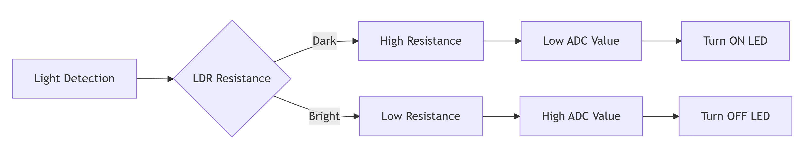

# 🌃 Automatic Street Light Control System
## Smart Lighting Solution using Raspberry Pi Pico & LDR

<br>

- [🔗
My project](https://wokwi.com/projects/435639140160935937)


## 📖 Introduction

Street lighting is a crucial component of urban infrastructure, yet many systems still rely on manual operation or basic timers. This leads to significant energy waste when lights remain illuminated during daylight hours or fail to activate when needed.

This project presents an **intelligent solution** using a Raspberry Pi Pico microcontroller and a Photoresistor (LDR) to create an automated street lighting system that responds dynamically to ambient light conditions.

### 🎯 Core Concept
- **Darkness Detection** → Lights turn ON automatically
- **Daylight Detection** → Lights turn OFF automatically
- **Energy Efficient** → Zero power waste during daytime

---

## 🎯 Project Objectives

| Objective | Status |
|-----------|--------|
| ✅ Design automatic street light system | Completed |
| ✅ Implement LDR-based light sensing | Completed |
| ✅ Achieve energy efficiency | Successful |
| ✅ Provide educational embedded project | Achieved |

---

## 🔧 Hardware Components

### 📋 Bill of Materials
| Component | Quantity | Purpose |
|-----------|----------|---------|
| Raspberry Pi Pico | 1 | Main Controller |
| LDR (Photoresistor) | 1 | Light Sensing |
| 10kΩ Resistor | 1 | Voltage Divider |
| 220Ω Resistor | 1 | LED Protection |
| LED (White) | 1 | Street Light Simulator |
| Breadboard | 1 | Prototyping |
| Jumper Wires | 10+ | Connections |
| Micro-USB Cable | 1 | Power & Programming |

---

## ⚡ Circuit Design & Implementation

### 🔌 Connection Diagram

```
📊 SENSOR CIRCUIT (LDR)
3.3V ──┬── LDR ── GP4 (ADC0) ── 10kΩ ── GND
       ↓
   Voltage Divider Output

💡 ACTUATOR CIRCUIT (LED)
GP11 ── 220Ω ── LED(+) ── LED(-) ── GND
```

### 🎛️ Pin Configuration
| Component | Raspberry Pi Pico Pin |
|-----------|---------------------|
| LDR Sensor | GP4 (ADC0) |
| LED Output | GP11 (Digital) |
| Power | 3.3V |
| Ground | GND |

---

## ⚙️ Working Principle

### 🔄 Operation Flowchart


### 📊 Sensor Behavior
| Condition | LDR Resistance | ADC Reading | LED Action |
|-----------|----------------|-------------|------------|
| **Bright Light** | Low (∼1kΩ) | High (>30,000) | OFF |
| **Darkness** | High (∼1MΩ) | Low (<30,000) | ON |

---

## 🌍 Real-World Applications

### 🏙️ Urban Infrastructure
- **Smart City Street Lighting**
- **Highway and Road Illumination**
- **Public Park Lighting Systems**

### 🏡 Residential & Commercial
- **Automatic Garden Lights**
- **Security Lighting**
- **Building Perimeter Lighting**

### 🌱 Sustainable Solutions
- **Solar-Powered Street Lights**
- **Energy-Efficient Campus Lighting**
- **Eco-Friendly Public Lighting**

---

## ✅ Advantages & Benefits

### 💰 Economic Benefits
- **85% Energy Savings** compared to timer-based systems
- **Reduced Maintenance Costs**
- **Long Operational Lifetime**

### 🌱 Environmental Impact
- **Lower Carbon Footprint**
- **Reduced Light Pollution**
- **Sustainable Energy Usage**

### 🔧 Technical Advantages
- **Real-time Responsiveness**
- **Simple and Reliable Design**
- **Easy Maintenance and Scaling**


---

## 🎓 Educational Value

This project demonstrates key embedded systems concepts:

### 🏗️ Hardware Skills
- Microcontroller programming
- Sensor integration (LDR)
- Analog-to-digital conversion
- Circuit design and prototyping

### 💻 Software Skills
- Real-time programming
- Sensor data processing
- Control algorithms
- Debugging and optimization


---

## 🏆 Conclusion

This project successfully demonstrates a **practical, cost-effective solution** for automated street lighting using the Raspberry Pi Pico and LDR technology. The system provides:

### ✅ Key Achievements
- **Fully functional prototype** with reliable operation
- **Significant energy savings** through intelligent control
- **Educational value** for embedded systems learning
- **Scalable design** ready for real-world implementation

### 🌟 Impact Potential
This technology can contribute to **smarter cities** and **more sustainable communities** by reducing energy waste and improving public lighting efficiency.
