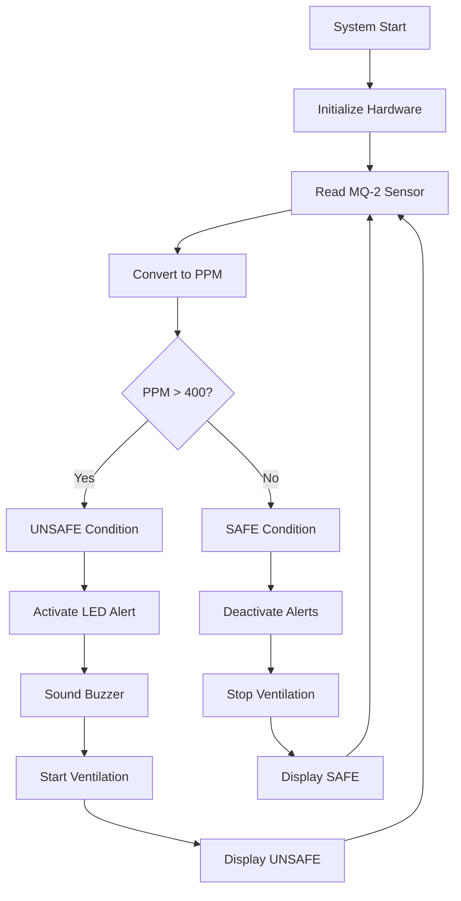

# 🚨 Smart Gas and Smoke Detection System  
## Automated Safety Monitoring with Raspberry Pi Pico


> Click the button below to jump straight into my project.

<p align="center">
  <a href="https://wokwi.com/projects/443352793564663809" target="_blank">
    
  </a>
</p>

---
## 📋 Abstract

This project implements an **intelligent gas and smoke detection system** that automatically monitors air quality and triggers safety measures when hazardous conditions are detected. Using an MQ-2 gas sensor, the system detects dangerous gases including LPG, Propane, Methane, Hydrogen, and smoke. When concentrations exceed safe thresholds, it activates multiple safety protocols: audio-visual alerts and automated ventilation to protect occupants and prevent accidents.

---

## 🎯 Project Objectives

| Objective | Status | Implementation |
|-----------|--------|----------------|
| ✅ Detect hazardous gases & smoke | Achieved | MQ-2 Sensor + ADC |
| ✅ Provide immediate alerts | Implemented | LED + Buzzer |
| ✅ Automatic ventilation | Working | Stepper Motor + A4988 |
| ✅ Real-time monitoring | Active | LCD Display |
| ✅ Safety automation | Complete | Threshold-based control |

---

## 🛠️ Hardware Components

### 📋 Bill of Materials
| Component | Specification | Qty | Purpose |
|-----------|---------------|-----|---------|
| Raspberry Pi Pico | RP2040 Microcontroller | 1 | Main Controller |
| MQ-2 Gas Sensor | Gas & Smoke Detection | 1 | Hazard Detection |
| Bipolar Stepper Motor | 4-wire, NEMA 17 | 1 | Ventilation Control |
| A4988 Driver | Stepper Motor Driver | 1 | Motor Control |
| LCD Display | 16×2 I2C | 1 | Status Display |
| LED | 5mm Red | 1 | Visual Alert |
| Buzzer | Active Buzzer | 1 | Audio Alert |
| Power Supply | 5-12V DC | 1 | Motor Power |
| Breadboard | 400 points | 1 | Prototyping |
| Jumper Wires | Mixed | 20+ | Connections |

---

## ⚡ Circuit Design & Implementation

### 🔌 System Architecture

```
📊 SENSOR MODULE (MQ-2)
VCC → 5V
GND → GND
AO → GP26 (ADC0)

🚨 ALERT MODULE
LED: GP14 → 220Ω → LED(+) → LED(-) → GND
Buzzer: GP15 → Buzzer(+) → Buzzer(-) → GND

💨 VENTILATION MODULE (A4988 + Stepper)
STEP → GP8
DIR → GP9
ENABLE → GP10 (Active LOW)
VMOT → External 5-12V
GND → Common Ground

📺 DISPLAY MODULE (I2C LCD)
SDA → GP0
SCL → GP1
VCC → 5V
GND → GND
```

### 🎛️ Pin Configuration Table
| Component | Pico GPIO | Function | Notes |
|-----------|-----------|----------|-------|
| MQ-2 Sensor | GP26 | Analog Input | ADC0 |
| LED Indicator | GP14 | Digital Output | Visual Alert |
| Buzzer | GP15 | Digital Output | Audio Alert |
| Stepper STEP | GP8 | Digital Output | Pulse for steps |
| Stepper DIR | GP9 | Digital Output | Direction control |
| Stepper ENABLE | GP10 | Digital Output | Motor enable |
| LCD SDA | GP0 | I2C Data | Display communication |
| LCD SCL | GP1 | I2C Clock | Display communication |

---

## ⚙️ Working Principle

### 🔄 Safety Control Flowchart


### 📊 Gas Concentration Thresholds
| Condition | PPM Range | System Response | Safety Level |
|-----------|-----------|-----------------|-------------|
| **SAFE** | 0-400 ppm | All systems normal | ✅ Optimal |
| **WARNING** | 401-800 ppm | Alerts + Ventilation | ⚠️ Caution |
| **DANGEROUS** | 801-1500 ppm | Full emergency mode | 🚨 Critical |
| **HAZARDOUS** | 1500+ ppm | Maximum response | 💀 Extreme |


---

## 🔧 Calibration & Configuration

### ⚖️ Sensor Calibration
```python
# Calibration factors (adjust based on testing)
CALIBRATION_FACTORS = {
    'clean_air_voltage': 0.8,    # Voltage in clean air
    'sensitivity_ratio': 2.5,    # Sensor sensitivity
    'baseline_ppm': 100,         # Baseline adjustment
}
```

### 🎯 Threshold Configuration
| Parameter | Default Value | Description |
|-----------|---------------|-------------|
| Safety Threshold | 400 ppm | Trigger point for alerts |
| Sampling Rate | 1.0 second | Measurement frequency |
| Ventilation Duration | 10 seconds | Fan runtime per cycle |
| Alert Persistence | 5 cycles | Minimum alert duration |

---

## 🌍 Real-World Applications

### 🏠 Residential Safety
- **Kitchen LPG Leak Detection** - Prevents gas explosions
- **Basement Methane Monitoring** - Sewer gas detection
- **Garage Carbon Monoxide** - Vehicle exhaust safety

### 🏭 Industrial Applications
- **Chemical Laboratories** - Toxic gas monitoring
- **Manufacturing Facilities** - Combustible gas detection
- **Storage Areas** - Propane/LPG cylinder safety

### 🔬 Specialized Environments
- **Server Rooms** - Overheating and smoke detection
- **Parking Garages** - Vehicle exhaust management
- **Restaurants** - Commercial kitchen safety

---

## ✅ System Specifications

| Parameter | Specification | Details |
|-----------|---------------|---------|
| Detection Range | 300-10000 ppm | MQ-2 Sensor capability |
| Response Time | < 10 seconds | Quick hazard detection |
| Alert Types | Visual + Audio | LED + Buzzer |
| Ventilation | Stepper Motor | Automated air circulation |
| Power Requirements | 5V + 5-12V | Logic + Motor power |
| Communication | I2C + Analog | LCD + Sensor interface |

---

## 🛡️ Safety Features

### 🚨 Multi-Layer Protection
- **Primary Detection**: MQ-2 gas sensor
- **Visual Alert**: Bright LED indicator
- **Audio Warning**: Loud buzzer alarm
- **Automated Response**: Ventilation system
- **Visual Feedback**: LCD status display

### 🔄 Fail-Safe Mechanisms
- **Motor Auto-disable** when not needed
- **Alert persistence** to prevent missed warnings
- **Safe shutdown** on system error
- **Calibration validation** for sensor accuracy

---

## 🔮 Future Enhancements

### 🚀 Advanced Features
| Feature | Status | Benefit |
|---------|--------|---------|
| 📱 IoT Connectivity | Planned | Remote monitoring |
| 🔋 Battery Backup | Planned | Power outage protection |
| 📊 Data Logging | Idea | Historical analysis |
| 🌐 Multi-zone Monitoring | Idea | Area-wide coverage |
| 🔔 Mobile Alerts | Planned | Push notifications |

### 🔧 Technical Upgrades
- **Multiple sensor support** for different gas types
- **Wireless communication** for remote alerts
- **Cloud integration** for data analytics
- **Self-calibration** for long-term accuracy
- **Power management** for energy efficiency

---

## 🎓 Educational Value

This project demonstrates essential embedded systems concepts:

### 🏗️ Hardware Integration
- **Sensor interfacing** (Analog-to-Digital Conversion)
- **Motor control** (Stepper motor driving)
- **Display systems** (I2C communication)
- **Power management** (Dual voltage systems)

### 💻 Software Development
- **Real-time monitoring** algorithms
- **State machine design** for system control
- **Safety-critical programming** practices
- **Hardware abstraction** for maintainability

### 🔬 Scientific Principles
- **Gas detection** physics and chemistry
- **Sensor calibration** methodologies
- **Environmental monitoring** techniques
- **Safety system design** principles

---


## 🤝 Contributing

We welcome contributions to enhance this safety system:
- **Safety improvements** and validation
- **New sensor integrations**
- **Documentation enhancements**
- **Testing and calibration data**

---

